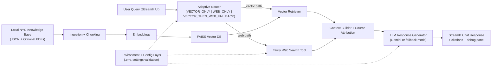

# TravelWise Architecture

## System overview
TravelWise uses adaptive routing to select the best knowledge source per query:
- `VECTOR_ONLY`: local retrieval only
- `WEB_ONLY`: Tavily for dynamic/live questions
- `VECTOR_THEN_WEB_FALLBACK`: local retrieval first, then Tavily when confidence is low

## Mermaid Diagram

## Components
- Router: heuristic + retrieval confidence aware decision logic
- Retrieval: FAISS similarity search with lexical overlap rescoring
- Tooling: Tavily integration for dynamic questions and fallback
- Generation: grounded synthesis prompt with structured itinerary output style
- UI: Streamlit product demo with sources and debug observability
